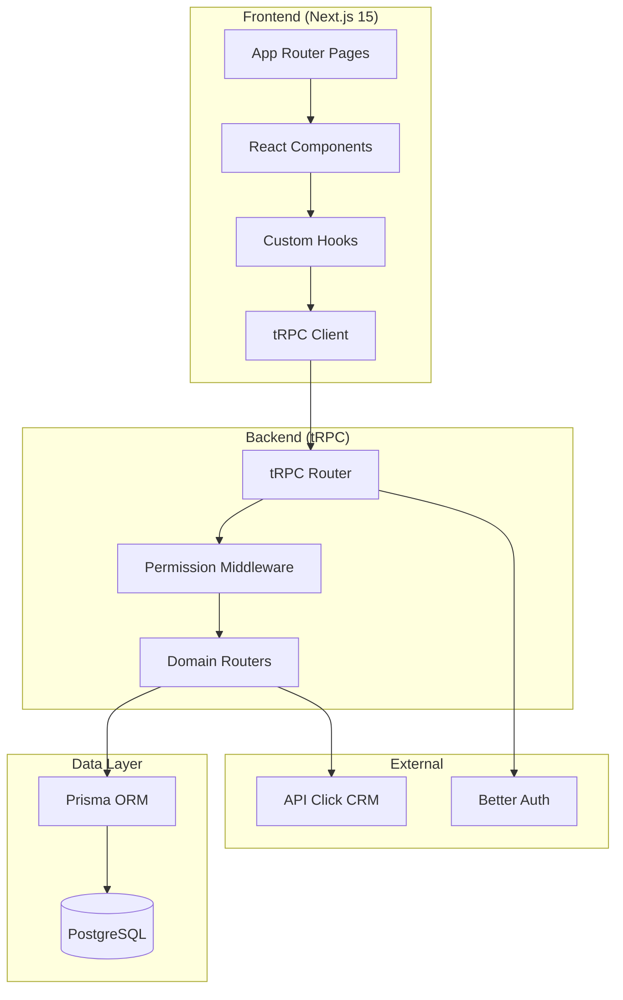

# Arquitetura do Sistema

## Estrutura do Monorepo

```
my-better-t-app/
├── apps/
│   └── web/                      # Aplicacao Next.js 15
│       ├── src/
│       │   ├── app/              # App Router
│       │   │   ├── (protected)/  # Rotas autenticadas
│       │   │   │   ├── dashboard/
│       │   │   │   ├── medicos/
│       │   │   │   ├── meus-horarios/
│       │   │   │   ├── solicitacoes/
│       │   │   │   └── emergenciais/
│       │   │   ├── api/          # API routes
│       │   │   └── login/
│       │   ├── components/
│       │   │   ├── ui/           # Componentes base
│       │   │   ├── medico/       # Componentes do medico
│       │   │   ├── staff/        # Componentes do staff
│       │   │   └── dashboard/    # Componentes de dashboard
│       │   ├── hooks/            # Custom hooks
│       │   └── lib/              # Utilitarios
│
├── packages/
│   ├── api/                      # tRPC Backend
│   │   └── src/
│   │       ├── index.ts          # Router base e procedures
│   │       ├── context.ts        # Contexto da requisicao
│   │       ├── middleware/       # Permissoes por role
│   │       └── routers/          # Endpoints organizados
│   │           ├── medicos.ts
│   │           ├── solicitacoes.ts
│   │           ├── emergenciais.ts
│   │           ├── cancelamento-emergencial.ts
│   │           ├── dashboard.ts
│   │           └── ...
│   │
│   ├── auth/                     # Better Auth
│   │   └── src/
│   │       └── index.ts          # Configuracao auth
│   │
│   └── db/                       # Prisma
│       ├── src/
│       │   └── index.ts          # Cliente Prisma exportado
│       └── prisma/
│           └── schema/           # Schemas organizados
│               ├── schema.prisma       # Config base
│               ├── auth.prisma         # User, Session, Account
│               ├── doctors.prisma      # MedicoConfig, Score, etc
│               └── cancelamento-emergencial.prisma
```

## Diagrama de Componentes



## Fluxo de Dados

### 1. Autenticacao
```
Cliente → Better Auth → Session → Context tRPC
```

### 2. Requisicao tRPC
```
Frontend Hook
    ↓
tRPC Client
    ↓
API Route (/api/trpc/*)
    ↓
Context (session validation)
    ↓
Permission Middleware
    ↓
Domain Router
    ↓
Prisma Query / Click API
    ↓
Response
```

## Middlewares de Permissao

Definidos em `packages/api/src/middleware/permissions.ts`:

| Procedure | Roles Permitidos | Uso |
|-----------|-----------------|-----|
| `publicProcedure` | Todos | Health check |
| `protectedProcedure` | Autenticados | Dados do usuario |
| `medicoProcedure` | medico | Solicitacoes, horarios |
| `staffProcedure` | atendente, diretor, admin | Aprovacoes |
| `overrideProcedure` | diretor, admin | Override de regras |
| `adminProcedure` | admin, super_admin | Configuracoes |

## Comunicacao com API Click

O sistema sincroniza dados com a API Click CRM via webhooks:

### Endpoints Utilizados

| Endpoint | Metodo | Uso |
|----------|--------|-----|
| `/ver-calendario-do-medico` | GET | Buscar horarios atuais |
| `/atualizar-hora-medico` | POST | Sincronizar horarios |
| `/validar-consultas-agendadas` | GET | Verificar consultas |
| `/listar-medicos` | GET | Sincronizar medicos |
| `/metricas-medicos-para-score` | GET | Calcular scores |

### Formato de Schedule (Click)

```json
{
  "doctor_id": 123,
  "schedule": {
    "SEG": ["08:00-12:00", "14:00-18:00"],
    "TER": ["08:00-12:00"],
    "QUA": [],
    "QUI": ["14:00-18:00"],
    "SEX": ["08:00-12:00", "14:00-18:00"],
    "SAB": [],
    "DOM": []
  }
}
```

## Conversao de Horarios

Os horarios sao armazenados em blocos (ex: "08:00-12:00") mas processados em slots de 20 minutos:

```
Bloco "08:00-12:00" → Slots ["08:00", "08:20", "08:40", "09:00", ...]
```

### Funcoes de Conversao

- `expandirHorario(bloco)` - Bloco → Array de slots
- `compactarSlots(slots)` - Array de slots → Array de blocos contiguos
- `calcularSlots(inicio, fim)` - Conta quantidade de slots em um intervalo

## Cache e Invalidacao

O sistema usa React Query (via tRPC) com invalidacao seletiva:

```typescript
// Apos aprovar solicitacao
queryClient.invalidateQueries({ queryKey: [["solicitacoes"]] });
queryClient.invalidateQueries({ queryKey: [["medicos"]] });
```

## Auditoria

Todas as acoes importantes sao registradas na tabela `Auditoria`:

```prisma
model Auditoria {
  id          String   @id
  usuarioId   String?  // null = acao do SISTEMA
  acao        String   // APROVAR_SLOTS, FECHAMENTO_AUTOMATICO, etc
  entidade    String?  // sugestao, medico_horario, etc
  entidadeId  String?
  dadosAntes  Json?
  dadosDepois Json?
  ip          String?
  userAgent   String?
  createdAt   DateTime
}
```

Acoes rastreadas:
- `APROVAR_SLOTS` - Staff aprovou slots
- `REJEITAR_SLOTS` - Staff rejeitou slots
- `FECHAMENTO_AUTOMATICO` - Sistema processou fechamento
- `OVERRIDE_APROVACAO` - Aprovacao com override
- `ALTERAR_SCORE_MANUAL` - Admin alterou score
- `EMERGENCIAL_CRIADA` - Staff criou emergencial
- `EMERGENCIAL_ACEITA` - Medico aceitou emergencial
