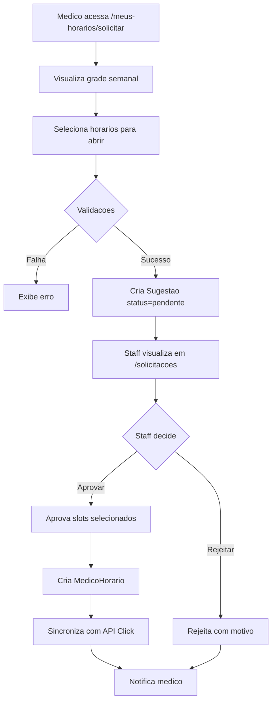

# Fluxo de Abertura de Horarios

## Visao Geral

Medicos solicitam abertura de horarios atraves de uma grade interativa. As solicitacoes vao para aprovacao do staff antes de serem efetivadas no sistema e sincronizadas com a API Click.

## Fluxograma



## Validacoes na Solicitacao

### 1. Horario Valido
```typescript
// Horario inicio deve ser menor que fim
if (horarioInicio >= horarioFim) {
  throw new TRPCError({ message: "Horario de inicio deve ser menor que horario de fim" });
}
```

### 2. Periodo Permitido pela Faixa
```typescript
const FAIXAS_CONFIG = {
  P1: { periodos: ["manha", "tarde", "noite"] },
  P2: { periodos: ["manha", "tarde", "noite"] },
  P3: { periodos: ["tarde", "noite"] },
  P4: { periodos: ["tarde"] },
  P5: { periodos: ["tarde"] },
};

// Verificar se horario esta em periodo permitido
const periodo = getPeriodo(horarioInicio);
if (!config.periodos.includes(periodo)) {
  throw new TRPCError({ message: `Periodo ${periodo} nao permitido para sua faixa` });
}
```

### 3. Dias Permitidos (MedicoConfig)
```typescript
// Se medico tem dias restritos
if (config.diasPermitidos && !config.diasPermitidos.includes(diaSemana)) {
  throw new TRPCError({ message: `Dia ${diaSemana} nao permitido` });
}
```

### 4. Restricoes por Dia (MedicoConfig)
```typescript
// Exemplo: seg so pode 08:00-18:00
if (config.restricoesDia?.seg) {
  if (horario < restricao.inicio || horario >= restricao.fim) {
    throw new TRPCError({ message: "Horario fora do intervalo permitido" });
  }
}
```

### 5. Limite de Slots (Faixa)
```typescript
const totalSlots = slotsAprovados + slotsPendentes + novosSlots;
if (maxSlots !== null && totalSlots > maxSlots) {
  throw new TRPCError({
    message: `Limite de ${maxSlots} slots semanais excedido`
  });
}
```

### 6. Solicitacao Duplicada
```typescript
const existente = await prisma.sugestao.findFirst({
  where: {
    medicoId,
    diaSemana,
    horarioInicio,
    status: "pendente",
  },
});

if (existente) {
  throw new TRPCError({ message: "Ja existe solicitacao pendente para este horario" });
}
```

## Formato do Lote (dadosLote)

Quando medico faz multiplas alteracoes de uma vez:

```json
{
  "tipo": "lote",
  "alteracoes": [
    {
      "diaSemana": "seg",
      "horario": "08:00",
      "acao": "abrir",
      "status": "pendente"
    },
    {
      "diaSemana": "seg",
      "horario": "08:20",
      "acao": "abrir",
      "status": "pendente"
    },
    {
      "diaSemana": "ter",
      "horario": "14:00",
      "acao": "fechar",
      "status": "aprovada"
    }
  ],
  "totalAbrir": 2,
  "totalFechar": 1
}
```

**Observacao**: Fechamentos sao processados imediatamente (status = "aprovada"), aberturas ficam pendentes.

## Aprovacao pelo Staff

### Tela de Solicitacoes

Staff acessa `/solicitacoes` e ve:
- Cards KPI: pendentes, atrasadas (>24h), aprovadas hoje
- Tabela agrupada por medico
- Grade expandivel com slots

### Aprovacao Parcial

Staff pode aprovar apenas alguns slots de um lote:

1. Expande grade do medico
2. Seleciona slots desejados (checkbox)
3. Clica "Aprovar Selecionados"
4. Slots nao selecionados ficam rejeitados

### Aprovacao com Override

Diretores+ podem aprovar ignorando restricoes:

```typescript
// Endpoint: solicitacoes.aprovarSlotsComOverride
input: {
  medicoId: string,
  slots: Array<{ diaSemana, horario }>,
  justificativa: string // min 10 chars
}
```

Registra em auditoria com acao `OVERRIDE_APROVAR_SLOTS`.

## Sincronizacao com API Click

Apos aprovacao, sistema sincroniza com Click:

```typescript
async function sincronizarComClick(medicoId, novosSlotsParaAdicionar) {
  // 1. Buscar calendario atual do Click
  const calendario = await buscarCalendarioClick(clickId);

  // 2. Expandir blocos em slots de 20 min
  for (const item of calendario) {
    const slots = expandirHorario(item.horario);
    // Adiciona ao schedule atual
  }

  // 3. Adicionar novos slots
  for (const slot of novosSlotsParaAdicionar) {
    scheduleAtual[diaClick].add(slot.horario);
  }

  // 4. Compactar de volta para blocos
  const scheduleFinal = {
    DOM: compactarSlots(scheduleAtual.DOM),
    SEG: compactarSlots(scheduleAtual.SEG),
    // ...
  };

  // 5. Enviar para Click
  await atualizarHorariosClick(clickId, scheduleFinal);
}
```

## Estados Visuais da Grade (Frontend)

| Estado | Cor | Descricao |
|--------|-----|-----------|
| `empty` | Cinza | Slot fechado |
| `selected` | Verde | Ja estava aberto |
| `new-selected` | Amarelo | Sera aberto |
| `to-close` | Vermelho | Sera fechado |
| `locked` | Cinza + cadeado | Tem consulta agendada |
| `blocked` | Opacity reduzida | Dia bloqueado (hoje+2) |

## Interacoes na Grade

### Click Simples
Toggle do slot selecionado.

### Shift + Click
Seleciona range do ultimo click ate o atual.

### Dias Bloqueados
Hoje e proximos 2 dias mostram cadeado e nao permitem alteracoes.

## Exemplo Completo

### Input da Requisicao

```typescript
// Endpoint: solicitacoes.criarLote
{
  alteracoes: [
    { diaSemana: "seg", horario: "08:00", acao: "abrir" },
    { diaSemana: "seg", horario: "08:20", acao: "abrir" },
    { diaSemana: "ter", horario: "14:00", acao: "fechar" }
  ]
}
```

### Processamento

1. **Separar aberturas e fechamentos**
   - Aberturas: seg 08:00, seg 08:20
   - Fechamentos: ter 14:00

2. **Validar aberturas contra faixa**
   - Medico P3: periodo "manha" (08:00) nao permitido
   - Erro retornado

3. **Se validacao passa, processar fechamentos**
   - Verificar antecedencia (ter nao pode ser hoje+2)
   - Verificar consultas agendadas
   - Desativar MedicoHorario
   - Sincronizar com Click

4. **Criar Sugestao para aberturas**
   - Status: pendente
   - dadosLote com todas alteracoes

### Output

```typescript
{
  success: true,
  tipo: "misto",
  totalAlteracoes: 3,
  abrir: 2,
  fechar: 1,
  fechamentosProcessados: true, // ja executou
  sugestaoId: "uuid-da-sugestao"
}
```

## Endpoints Relacionados

| Endpoint | Tipo | Uso |
|----------|------|-----|
| `solicitacoes.criar` | mutation | Cria solicitacao simples |
| `solicitacoes.criarLote` | mutation | Cria lote de abrir/fechar |
| `solicitacoes.aprovarSlots` | mutation | Staff aprova slots |
| `solicitacoes.rejeitarSlots` | mutation | Staff rejeita slots |
| `solicitacoes.aprovarSlotsComOverride` | mutation | Override (diretor+) |
| `solicitacoes.listarAgrupado` | query | Lista para staff |
| `solicitacoes.minhasSugestoes` | query | Lista para medico |
| `solicitacoes.cancelar` | mutation | Medico cancela pendente |
