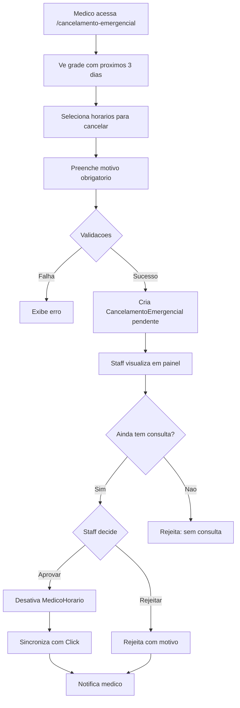
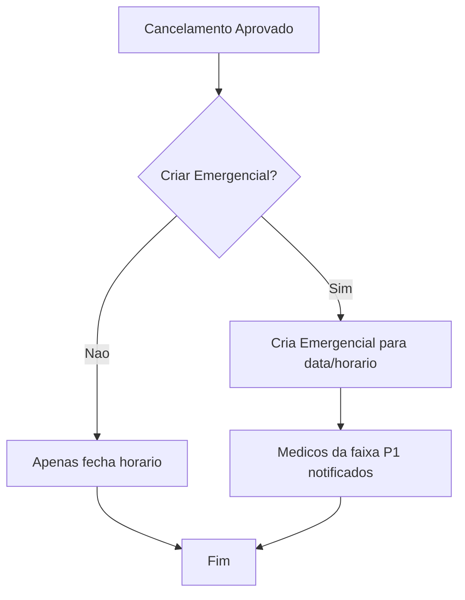

# Cancelamento Emergencial

## Quando Usar

Cancelamento emergencial e usado quando:
- Medico precisa cancelar horario que **JA TEM consulta agendada**
- Situacoes de emergencia (doenca, problema familiar, etc.)

**Importante**: Diferente do fechamento normal, cancelamento emergencial REQUER aprovacao do staff.

## Motivos Disponiveis

| Categoria | Valor | Descricao |
|-----------|-------|-----------|
| `doenca` | Doenca | Doenca ou problema de saude |
| `emergencia_familiar` | Emergencia Familiar | Emergencia familiar urgente |
| `compromisso_medico` | Compromisso Medico | Compromisso medico urgente |

## Fluxograma



## Restricao de Dias

Cancelamento emergencial so se aplica aos **proximos 3 dias** (hoje + 2):

```typescript
function getDiasBloqueadosParaCancelamento(): string[] {
  const dias = ["dom", "seg", "ter", "qua", "qui", "sex", "sab"];
  const bloqueados: string[] = [];
  const hoje = new Date();

  for (let i = 0; i < 3; i++) {
    const data = new Date(hoje);
    data.setDate(hoje.getDate() + i);
    bloqueados.push(dias[data.getDay()]);
  }

  return bloqueados;
}
```

**Exemplo**: Se hoje e quinta:
- Cancelamento emergencial: quinta, sexta, sabado
- Fechamento normal: domingo em diante

## Validacoes

### 1. Apenas Proximos 3 Dias
```typescript
// Horarios de hoje + 2 dias
const diasPermitidos = getDiasBloqueadosParaCancelamento();
if (!diasPermitidos.includes(diaSemana)) {
  throw new TRPCError({
    message: "Cancelamento emergencial so para proximos 3 dias"
  });
}
```

### 2. Horario Aberto
```typescript
const horario = await prisma.medicoHorario.findFirst({
  where: { medicoId, diaSemana, horarioInicio, ativo: true }
});

if (!horario) {
  throw new TRPCError({ message: "Horario nao encontrado ou ja fechado" });
}
```

### 3. Motivo Obrigatorio
```typescript
const schema = z.object({
  motivoCategoria: z.enum(["doenca", "emergencia_familiar", "compromisso_medico"]),
  motivoDescricao: z.string().optional()
});
```

### 4. Sem Duplicata
```typescript
const existente = await prisma.cancelamentoEmergencial.findFirst({
  where: {
    medicoId,
    diaSemana,
    horarioInicio,
    status: "pendente"
  }
});

if (existente) {
  throw new TRPCError({ message: "Ja existe cancelamento pendente" });
}
```

## Modelo de Dados

```prisma
model CancelamentoEmergencial {
  id                String              @id @default(uuid())
  medicoId          String
  medico            User                @relation(...)

  diaSemana         DiaSemana
  horarioInicio     String              // HH:MM
  horarioFim        String              // HH:MM
  status            CancelamentoStatus  @default(pendente)

  // Motivo do medico
  motivoCategoria   MotivoCancelamento
  motivoDescricao   String?

  // Resposta do staff
  motivoRejeicao    String?
  processadoPorId   String?
  processadoPor     User?               @relation(...)
  processadoEm      DateTime?

  createdAt         DateTime
  updatedAt         DateTime
}

enum CancelamentoStatus {
  pendente
  aprovado
  rejeitado
}

enum MotivoCancelamento {
  doenca
  emergencia_familiar
  compromisso_medico
}
```

## Criacao pelo Medico

### Endpoint
```typescript
// cancelamentoEmergencial.criar
input: {
  slots: Array<{
    diaSemana: "dom" | "seg" | "ter" | "qua" | "qui" | "sex" | "sab",
    horario: string // "HH:MM"
  }>,
  motivoCategoria: "doenca" | "emergencia_familiar" | "compromisso_medico",
  motivoDescricao?: string
}
```

### Exemplo
```typescript
{
  slots: [
    { diaSemana: "qui", horario: "14:00" },
    { diaSemana: "qui", horario: "14:20" }
  ],
  motivoCategoria: "doenca",
  motivoDescricao: "Consulta medica de emergencia"
}
```

## Processamento pelo Staff

### Tela de Cancelamentos

Staff visualiza painel com:
- Lista de cancelamentos pendentes
- Filtros por medico, data
- Info do motivo
- Status de consultas (via API Click)

### Aprovar

```typescript
// cancelamentoEmergencial.aprovar
input: { id: string }

// Processamento:
// 1. Desativar MedicoHorario
// 2. Sincronizar com Click
// 3. Atualizar status = aprovado
// 4. Notificar medico
```

### Rejeitar

```typescript
// cancelamentoEmergencial.rejeitar
input: {
  id: string,
  motivo: string // Obrigatorio
}

// Processamento:
// 1. Atualizar status = rejeitado
// 2. Salvar motivoRejeicao
// 3. Notificar medico
```

## Estados Visuais (Frontend)

### Grade do Medico

| Estado | Aparencia | Descricao |
|--------|-----------|-----------|
| `available` | Verde | Pode selecionar para cancelar |
| `selected` | Vermelho | Selecionado para cancelar |
| `locked` | Verde + badge | Tem consulta (mostra quantidade) |
| `pending` | Amarelo | Ja tem cancelamento pendente |
| `blocked` | Cinza | Fora dos proximos 3 dias |

### Card de Solicitacao (Staff)

- **Pendente**: Badge amarelo
- **Aprovado**: Badge verde
- **Rejeitado**: Badge vermelho

## Endpoints Relacionados

### Para Medico

| Endpoint | Tipo | Descricao |
|----------|------|-----------|
| `cancelamentoEmergencial.criar` | mutation | Cria solicitacao |
| `cancelamentoEmergencial.listarHorariosDisponiveis` | query | Horarios para cancelar |
| `cancelamentoEmergencial.minhasSolicitacoes` | query | Historico do medico |

### Para Staff

| Endpoint | Tipo | Descricao |
|----------|------|-----------|
| `cancelamentoEmergencial.listarPendentes` | query | Lista pendentes |
| `cancelamentoEmergencial.aprovar` | mutation | Aprova cancelamento |
| `cancelamentoEmergencial.rejeitar` | mutation | Rejeita com motivo |

## Exemplo de Input/Output

### Criar Cancelamento

**Input:**
```json
{
  "slots": [
    { "diaSemana": "qui", "horario": "14:00" }
  ],
  "motivoCategoria": "doenca",
  "motivoDescricao": "Problema de saude"
}
```

**Output:**
```json
{
  "success": true,
  "cancelamento": {
    "id": "uuid",
    "status": "pendente",
    "diaSemana": "qui",
    "horarioInicio": "14:00",
    "horarioFim": "14:20"
  }
}
```

### Aprovar Cancelamento

**Input:**
```json
{
  "id": "uuid-do-cancelamento"
}
```

**Output:**
```json
{
  "success": true,
  "cancelamento": {
    "id": "uuid",
    "status": "aprovado",
    "processadoEm": "2024-01-15T10:30:00Z"
  }
}
```

### Rejeitar Cancelamento

**Input:**
```json
{
  "id": "uuid-do-cancelamento",
  "motivo": "Consulta ja foi reagendada pelo paciente"
}
```

**Output:**
```json
{
  "success": true,
  "cancelamento": {
    "id": "uuid",
    "status": "rejeitado",
    "motivoRejeicao": "Consulta ja foi reagendada pelo paciente"
  }
}
```

## Diferenca: Fechamento Normal vs Cancelamento Emergencial

| Aspecto | Fechamento Normal | Cancelamento Emergencial |
|---------|-------------------|-------------------------|
| Tem consulta | NAO | SIM |
| Aprovacao | Imediato | Requer staff |
| Dias aplicaveis | Apos hoje+2 | Hoje ate hoje+2 |
| Motivo | Opcional | Obrigatorio |
| Modelo | MedicoHorario | CancelamentoEmergencial |
| Rota | `/meus-horarios/cancelar` | `/meus-horarios/cancelamento-emergencial` |

---

## Processos Automaticos

### Verificacao de Consultas

Antes de aprovar, o sistema verifica se ainda existe consulta no horario:
- Se consulta foi cancelada pelo paciente → Rejeita automaticamente
- Se consulta ainda existe → Staff decide

### Notificacoes

| Evento | Notificacao |
|--------|-------------|
| Cancelamento criado | Staff recebe alerta |
| Cancelamento aprovado | Medico notificado |
| Cancelamento rejeitado | Medico notificado com motivo |

---

## Endpoints de Cron

O sistema nao possui crons especificos para cancelamento emergencial, mas os cancelamentos sao monitorados em tempo real pelo staff atraves do painel.

### Polling do Painel Staff

```typescript
const { interval } = useSmartPolling("cancelamento");
// Ativo: 15s, Background: 45s
```

---

## Integracao com Emergenciais

Quando um cancelamento emergencial e **aprovado**:

1. Horario e fechado no sistema local
2. Horario e sincronizado com Click API
3. **Pode** criar uma emergencial automatica se:
   - Horario tinha consulta marcada
   - Staff configura para criar emergencial


