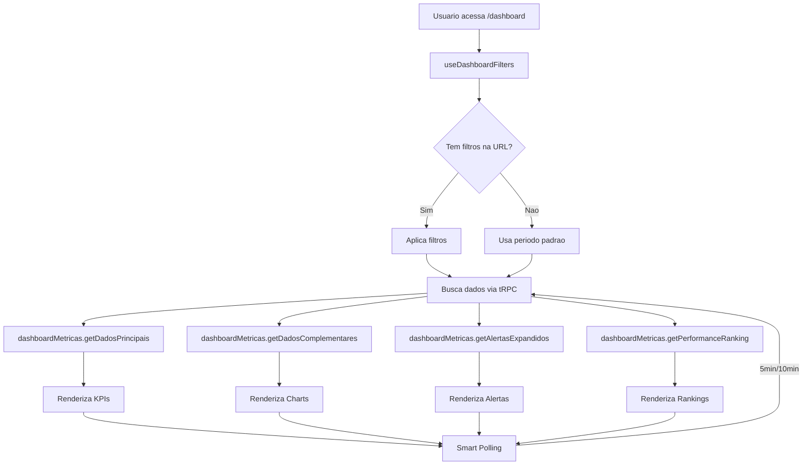

# Dashboard - Centro de Comando

## Visao Geral

O dashboard e o centro de comando para staff e gestores, fornecendo:
- KPIs em tempo real
- Analise de performance de medicos
- Sistema de alertas inteligentes
- Rankings e comparativos

## Paginas do Dashboard

### 1. Visao Geral (`/dashboard`)

Pagina principal com metricas agregadas.

```
+------------------------------------------------------------------+
| Dashboard                                    [Data: Ultimos 7 dias v]
+------------------------------------------------------------------+
|                                                                    |
|  +-------------+  +-------------+  +-------------+  +-------------+
|  | Consultas   |  | Realizadas  |  | Faturamento |  | Conversao   |
|  | Agendadas   |  |             |  |             |  |             |
|  |    245      |  |    198      |  |  R$ 48.500  |  |   67.5%     |
|  |   +12%      |  |   +8%       |  |   +15%      |  |   +2.3%     |
|  +-------------+  +-------------+  +-------------+  +-------------+
|                                                                    |
|  +---------------------------+  +--------------------------------+
|  | Saude da Operacao         |  | Acoes Urgentes                 |
|  |                           |  |                                |
|  | Comparecimento: ████░ 81% |  | ! Dr. Silva - No-show alto     |
|  | No-Show:        ██░░░ 19% |  | ! Dra. Ana - Conversao baixa   |
|  | SLA Receitas:   ████░ 75% |  | ! 3 solicitacoes atrasadas     |
|  |                           |  |                                |
|  | Score Geral: 78/100       |  | [Ver todas →]                  |
|  +---------------------------+  +--------------------------------+
|                                                                    |
|  +---------------------------+  +--------------------------------+
|  | Top Performers            |  | Precisam de Atencao            |
|  |                           |  |                                |
|  | 1. Dr. Joao - 4.9* 72%    |  | 1. Dr. Pedro - No-show 35%     |
|  | 2. Dra. Maria - 4.8* 68%  |  | 2. Dra. Clara - Conv. 45%      |
|  | 3. Dr. Carlos - 4.7* 65%  |  | 3. Dr. Marcos - Nota 3.2       |
|  |                           |  |                                |
|  | [Ver ranking completo →]  |  | [Ver detalhes →]               |
|  +---------------------------+  +--------------------------------+
|                                                                    |
|  +------------------------------------------------------------------+
|  | Distribuicao por Hora                                            |
|  |                                                                  |
|  |  |     ██                                                        |
|  |  |  ██ ██ ██                                                     |
|  |  |  ██ ██ ██ ██    ██                                            |
|  |  |  ██ ██ ██ ██ ██ ██ ██ ██                                      |
|  |  +--08--09--10--11--12--14--15--16--17--18--19--20--21--         |
|  +------------------------------------------------------------------+
|                                                                    |
|  +------------------------------------------------------------------+
|  | Ranking Completo de Medicos                                      |
|  +------------------------------------------------------------------+
|  | # | Nome        | Consultas | Receitas | Fatur.  | Conv. | Faixa|
|  +---+-------------+-----------+----------+---------+-------+------+
|  | 1 | Dr. Joao    |    45     |    38    | R$12.5k | 72%   | P1   |
|  | 2 | Dra. Maria  |    42     |    35    | R$11.2k | 68%   | P1   |
|  | 3 | Dr. Carlos  |    38     |    30    | R$9.8k  | 65%   | P2   |
|  +------------------------------------------------------------------+
+------------------------------------------------------------------+
```

#### KPIs Principais

| KPI | Descricao | Calculo |
|-----|-----------|---------|
| Consultas Agendadas | Total de agendamentos | Soma de consultas agendadas |
| Realizadas | Consultas efetivadas | Soma de consultas realizadas |
| Faturamento | Receita total | Soma de valores pagos |
| Conversao | Taxa de conversao | Realizadas / Agendadas * 100 |

#### Saude da Operacao

Score geral baseado em:
- **Comparecimento**: Taxa de pacientes que comparecem
- **No-Show**: Taxa de faltas (meta: < 15%)
- **SLA Receitas**: Receitas emitidas em < 1h (meta: > 80%)

#### Top Performers vs Precisam Atencao

- **Top 3**: Medicos com melhor performance geral
- **At-Risk 3**: Medicos que precisam de suporte

---

### 2. Central de Alertas (`/dashboard/alertas`)

Sistema de alertas categorizados por severidade.

```
+------------------------------------------------------------------+
| Central de Alertas                                                |
+------------------------------------------------------------------+
|                                                                    |
|  [Todos: 12]  [Criticos: 3]  [Alertas: 5]  [Oportunidades: 4]     |
|  ─────────────────────────────────────────────────────────────    |
|                                                                    |
|  CRITICOS (Acao Imediata)                                         |
|  +----------------------------------------------------------------+
|  | ! No-Show Critico                                   Dr. Silva  |
|  |   Taxa de no-show em 35% (meta: 15%)                           |
|  |   [Ver performance →]                                          |
|  +----------------------------------------------------------------+
|  | ! Conversao Critica                                 Dra. Ana   |
|  |   Taxa de conversao em 42% (meta: 55%)                         |
|  |   [Ver performance →]                                          |
|  +----------------------------------------------------------------+
|                                                                    |
|  ALERTAS (Monitorar)                                              |
|  +----------------------------------------------------------------+
|  | ! Receita Atrasada                                  Dr. Pedro  |
|  |   SLA receitas em 65% (meta: 80%)                              |
|  +----------------------------------------------------------------+
|  | ! Risco Rebaixamento                                Dr. Marcos |
|  |   Risco de rebaixamento de P2 para P3                          |
|  +----------------------------------------------------------------+
|                                                                    |
|  OPORTUNIDADES (Positivo)                                         |
|  +----------------------------------------------------------------+
|  | * Pronto para Promocao                              Dra. Clara |
|  |   Performance consistente para P1                              |
|  +----------------------------------------------------------------+
|  | * Review Champion                                   Dr. Joao   |
|  |   Nota media 4.9 - Destaque em avaliacoes                      |
|  +----------------------------------------------------------------+
+------------------------------------------------------------------+
```

#### Tipos de Alertas

| Tipo | Severidade | Trigger |
|------|------------|---------|
| `noShowCritico` | Critico | No-show > 30% |
| `conversaoCritica` | Critico | Conversao < 45% |
| `receitaAtrasada` | Alerta | SLA < 70% |
| `notaMinima1` | Alerta | Nota < 3.5 |
| `riscoRebaixamento` | Alerta | Score proximo ao limite |
| `prontoPromocao` | Oportunidade | Performance consistente alta |
| `reviewChampion` | Oportunidade | Nota > 4.8 |

#### Cores por Severidade

| Severidade | Cor | Icone |
|------------|-----|-------|
| Critico | Vermelho (`text-red-600`) | AlertTriangle |
| Alerta | Amarelo (`text-amber-600`) | AlertCircle |
| Oportunidade | Verde (`text-green-600`) | TrendingUp |

---

### 3. Performance Individual (`/dashboard/medicos`)

Analise detalhada de um medico especifico.

```
+------------------------------------------------------------------+
| Performance Individual                [Medico: Dr. Joao Silva v]  |
+------------------------------------------------------------------+
|                                                                    |
|  +------------------------------------------------------------------+
|  | Comparativo com Plataforma                                       |
|  +------------------------------------------------------------------+
|  |              Medico    Plataforma    Desvio                      |
|  |  Conversao    72%        65%         +10.8%  ↑                  |
|  |  No-Show      12%        18%         -33.3%  ↑ (melhor)         |
|  |  Ticket Med   R$320      R$285       +12.3%  ↑                  |
|  |  Nota Media   4.8        4.2         +14.3%  ↑                  |
|  |  Receita <1h  85%        75%         +13.3%  ↑                  |
|  +------------------------------------------------------------------+
|                                                                    |
|  +-------------+  +-------------+  +-------------+  +-------------+
|  | Volume      |  | Prescricao  |  | Financeiro  |  | Eficiencia  |
|  +-------------+  +-------------+  +-------------+  +-------------+
|  | Agendadas:45|  | Com: 38 82% |  | Fatur:R$12k |  | Tempo: 25m  |
|  | Realizadas:42| | Sem: 7  18% |  | Ticket: R320|  | SLA 1h: 85% |
|  | No-Show: 3  |  |             |  | Orc: R$8.5k |  | Mesmo dia:  |
|  | Canceladas:2|  | ████████░░  |  |             |  |    92%      |
|  |             |  |             |  | Conv: 72%   |  |             |
|  | Novos: 15   |  |             |  |             |  | Reviews:    |
|  | Recorr: 27  |  |             |  |             |  |  Min: 4.5   |
|  +-------------+  +-------------+  +-------------+  |  Max: 5.0   |
|                                                     |  Med: 4.8   |
|                                                     +-------------+
|                                                                    |
|  +------------------------------------------------------------------+
|  | Analise de No-Shows                                              |
|  +------------------------------------------------------------------+
|  | Paciente nao compareceu     ████████████████░░░░  40% (2)       |
|  | Problemas tecnicos          ████████░░░░░░░░░░░░  20% (1)       |
|  | Reagendamento               ████████░░░░░░░░░░░░  20% (1)       |
|  | Atraso/Tolerancia           ████░░░░░░░░░░░░░░░░  10% (0.5)     |
|  | Outros                      ████░░░░░░░░░░░░░░░░  10% (0.5)     |
|  +------------------------------------------------------------------+
+------------------------------------------------------------------+
```

#### Cards de Metricas

**CardVolume:**
- Consultas agendadas, realizadas, no-shows, canceladas
- Pacientes novos vs recorrentes

**CardPrescricao:**
- Consultas com receita vs sem receita
- Barra de progresso visual

**CardFinanceiro:**
- Faturamento total
- Ticket medio
- Orcamentos pagos
- Taxa de conversao

**CardEficienciaExpandido:**
- Tempo medio para receita
- SLA receitas < 1h
- SLA receitas mesmo dia
- Notas de reviews (min/max/media)

---

## Componentes do Dashboard

### DateRangePicker

Seletor de periodo com presets.

**Presets Disponiveis:**
- Hoje
- Ontem
- Ultimos 7 dias
- Mes anterior
- Mes atual
- Ultimo trimestre
- Personalizado

```typescript
interface DateRange {
  dataInicio: string;  // "YYYY-MM-DD"
  dataFim: string;     // "YYYY-MM-DD"
  label: string;       // "Ultimos 7 dias"
}
```

### KPICard

Card individual de KPI.

```typescript
interface KPICardProps {
  titulo: string;
  valor: number;
  formato: "numero" | "moeda" | "porcentagem";
  variacao?: number;      // % vs periodo anterior
  icone?: LucideIcon;
}
```

### SaudeOperacao

Scorecard de saude operacional.

```typescript
interface SaudeOperacaoProps {
  comparecimento: number;  // 0-100
  noShow: number;          // 0-100
  slaReceitas: number;     // 0-100
  scoreGeral: number;      // 0-100
}
```

### ComparativoPlataforma

Tabela comparativa medico vs plataforma.

```typescript
interface ComparativoProps {
  medico: Metricas;
  plataforma: Metricas;
  desvios: Desvios;
}

interface Metricas {
  conversao: number;
  noShow: number;
  ticketMedio: number;
  notaMedia: number;
  receita1h: number;
}
```

### CardMotivosNoShow

Analise de motivos de no-show.

**Categorias:**
1. Paciente nao compareceu
2. Problemas tecnicos/Conexao
3. Reagendamento
4. Atraso/Tolerancia excedida
5. Outros motivos
6. Sem motivo registrado
7. Retorno medico

---

## Hooks do Dashboard

### useDashboardFilters

Gerencia filtros via URL.

```typescript
const {
  dateRange,         // { dataInicio, dataFim, label }
  doctorId,          // ID do medico selecionado
  setDateRange,      // Atualiza periodo
  setDoctorId,       // Seleciona medico
  clearDoctorId,     // Limpa selecao
  updateFilters,     // Atualiza multiplos
  getTabUrl          // URL para navegacao
} = useDashboardFilters();
```

### useSmartPolling (Dashboard)

Polling especifico para dashboard.

```typescript
const { interval } = useSmartPolling('dashboard');
// Ativo: 5 minutos
// Background: 10 minutos
```

---

## Fluxo de Dados



---

## Navegacao

### DashboardNav

Tabs de navegacao entre paginas.

```typescript
const tabs = [
  { label: "Visao Geral", href: "/dashboard" },
  { label: "Performance Individual", href: "/dashboard/medicos" },
  { label: "Central de Alertas", href: "/dashboard/alertas" }
];
```

**Importante:** Filtros sao preservados ao navegar entre tabs.

---

## Permissoes

| Pagina | Roles Permitidos |
|--------|------------------|
| `/dashboard` | staff, diretor, admin, super_admin |
| `/dashboard/alertas` | staff, diretor, admin, super_admin |
| `/dashboard/medicos` | staff, diretor, admin, super_admin |

---

## Queries tRPC Utilizadas

| Pagina | Queries |
|--------|---------|
| Visao Geral | `getDadosPrincipais`, `getDadosComplementares`, `getAlertasExpandidos`, `getPerformanceRanking`, `getAnaliseNoShows`, `listarMedicosParaFiltro` |
| Central de Alertas | `getAlertasExpandidos`, `listarMedicosParaFiltro` |
| Performance Individual | `getComparativoMedico`, `getAnaliseNoShows`, `listarMedicosParaFiltro` |

---

## Cores e Estilos

### Desvios (ComparativoPlataforma)

| Condicao | Cor |
|----------|-----|
| Acima da media | `text-green-600` |
| Abaixo da media | `text-red-600` |
| Neutro | `text-gray-600` |

### Alertas

| Severidade | Background | Text |
|------------|------------|------|
| Critico | `bg-red-50` | `text-red-700` |
| Alerta | `bg-amber-50` | `text-amber-700` |
| Oportunidade | `bg-green-50` | `text-green-700` |

### Ranking

| Posicao | Cor Medal |
|---------|-----------|
| 1 | Ouro (`text-yellow-500`) |
| 2 | Prata (`text-gray-400`) |
| 3 | Bronze (`text-amber-600`) |
