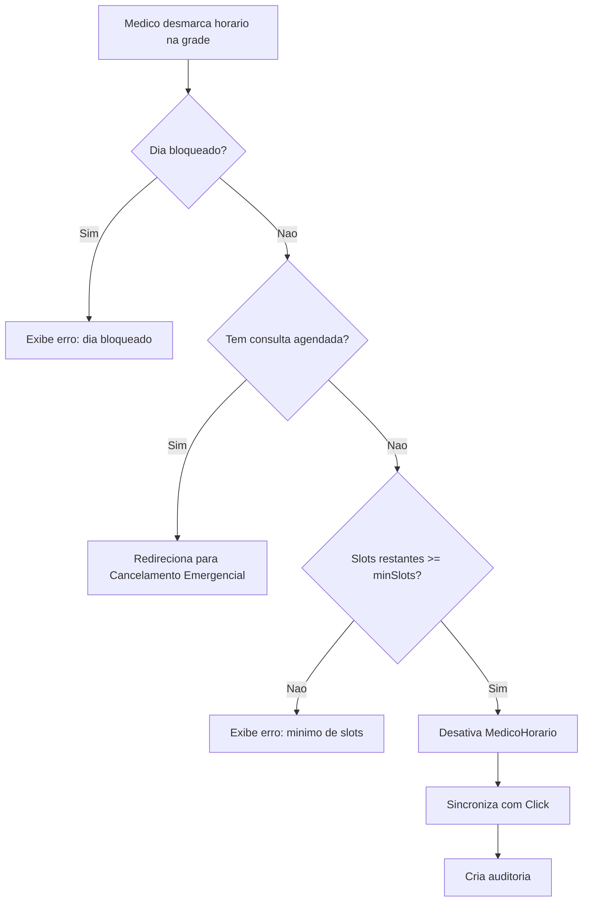

# Fluxo de Fechamento de Horarios

## Visao Geral

Existem dois tipos de fechamento:
1. **Fechamento Normal**: Quando o horario NAO tem consulta agendada
2. **Cancelamento Emergencial**: Quando o horario TEM consulta agendada

## Regra de Antecedencia

Aplica-se a AMBOS os tipos de fechamento:

```
NAO pode fechar: hoje + proximos 2 dias
```

**Exemplo**: Se hoje e quinta-feira:
- Bloqueados: quinta, sexta, sabado
- Permitidos: domingo em diante

### Implementacao

```typescript
function podeCancelarDiaSemana(diaSemana: string): boolean {
  const diasSemanaOrdem = ["dom", "seg", "ter", "qua", "qui", "sex", "sab"];
  const hoje = new Date();
  const diaHoje = hoje.getDay();

  // Calcular dias bloqueados (hoje + 2)
  const diasBloqueados = new Set<string>();
  for (let i = 0; i <= 2; i++) {
    const diaIdx = (diaHoje + i) % 7;
    diasBloqueados.add(diasSemanaOrdem[diaIdx]);
  }

  return !diasBloqueados.has(diaSemana.toLowerCase());
}
```

## Fechamento Normal (Imediato)

### Quando Usar
- Medico quer fechar horario que NAO tem consulta agendada

### Caracteristicas
- Processado imediatamente (sem aprovacao)
- Desativa registro em `MedicoHorario` (ativo = false)
- Sincroniza com API Click na hora
- Cria registro de auditoria com autor = SISTEMA

### Fluxograma



### Validacoes

1. **Dia nao bloqueado**
```typescript
if (!podeCancelarDiaSemana(fechamento.diaSemana)) {
  throw new TRPCError({
    message: `Nao e possivel fechar horarios dos proximos 2 dias`
  });
}
```

2. **Sem consultas agendadas**
```typescript
const consultasAgendadas = await fetch(
  `${CLICK_BASE_URL}/validar-consultas-agendadas?doctor_id=${clickId}`
);

if (slotsComConsulta.has(key)) {
  throw new TRPCError({
    message: `Nao e possivel fechar ${diaSemana} ${horario}: existe consulta agendada`
  });
}
```

3. **Minimo de slots**
```typescript
const slotsAposFechamento = slotsAtuais - fechamentos.length;
if (slotsAposFechamento < config.minSlots) {
  throw new TRPCError({
    message: `Minimo de ${config.minSlots} slots para faixa ${faixa}`
  });
}
```

### Processamento

```typescript
// 1. Desativar MedicoHorario
await prisma.medicoHorario.updateMany({
  where: {
    medicoId,
    diaSemana,
    horarioInicio,
    ativo: true,
  },
  data: { ativo: false },
});

// 2. Sincronizar com Click
await sincronizarFechamentosComClick(medicoId, slots);

// 3. Registrar auditoria (autor = SISTEMA)
await prisma.auditoria.create({
  data: {
    usuarioId: null, // SISTEMA
    acao: "FECHAMENTO_AUTOMATICO",
    entidade: "medico_horario",
    entidadeId: medicoId,
    dadosDepois: {
      fechamentos,
      processadoPor: "SISTEMA",
    },
  },
});
```

## Sincronizacao de Fechamentos com Click

```typescript
async function sincronizarFechamentosComClick(medicoId, slotsParaRemover) {
  // 1. Buscar calendario atual
  const calendario = await buscarCalendarioClick(clickId);

  // 2. Expandir em slots de 20 min
  const scheduleAtual = { DOM: new Set(), SEG: new Set(), ... };
  for (const item of calendario) {
    const slots = expandirHorario(item.horario);
    for (const slot of slots) {
      scheduleAtual[dia].add(slot);
    }
  }

  // 3. REMOVER slots do schedule
  for (const slot of slotsParaRemover) {
    scheduleAtual[diaClick].delete(slot.horario);
  }

  // 4. Compactar e enviar
  const scheduleFinal = {
    DOM: compactarSlots(scheduleAtual.DOM),
    // ...
  };
  await atualizarHorariosClick(clickId, scheduleFinal);
}
```

## Fechamento em Lote

Quando medico fecha multiplos horarios de uma vez:

### Input
```typescript
{
  alteracoes: [
    { diaSemana: "seg", horario: "14:00", acao: "fechar" },
    { diaSemana: "seg", horario: "14:20", acao: "fechar" },
    { diaSemana: "ter", horario: "08:00", acao: "abrir" }
  ]
}
```

### Processamento
1. Separar aberturas e fechamentos
2. Validar todos os fechamentos
3. **Executar fechamentos imediatamente**
4. Criar Sugestao para aberturas (se houver)

### Output
```typescript
{
  success: true,
  tipo: "misto",
  totalAlteracoes: 3,
  abrir: 1,
  fechar: 2,
  fechamentosProcessados: true
}
```

## Sugestao de Historico

Mesmo fechamentos imediatos criam um registro de Sugestao para historico:

```typescript
await prisma.sugestao.create({
  data: {
    medicoId,
    diaSemana: fechamentos[0].diaSemana,
    horarioInicio: fechamentos[0].horario,
    horarioFim: calcularHorarioFim(fechamentos[0].horario),
    status: "aprovada",
    automatico: true, // Marca como processamento automatico
    dadosLote: JSON.stringify({
      tipo: "lote",
      alteracoes: fechamentos.map(f => ({
        diaSemana: f.diaSemana,
        horario: f.horario,
        acao: "fechar",
        status: "aprovada",
      })),
      totalAbrir: 0,
      totalFechar: fechamentos.length,
    }),
  },
});
```

## Estados na Grade (Frontend)

| Estado | Aparencia | Acao |
|--------|-----------|------|
| Horario aberto | Verde | Click desmarca |
| Marcado para fechar | Vermelho | Click cancela |
| Com consulta | Verde + badge | Click mostra alerta |
| Dia bloqueado | Cadeado | Click ignorado |

## Mensagens de Erro

| Situacao | Mensagem |
|----------|----------|
| Dia bloqueado | "Nao e possivel fechar horarios dos proximos 2 dias" |
| Com consulta | "Nao e possivel fechar: existe consulta agendada" |
| Minimo slots | "Minimo de X slots para faixa Y. Voce teria apenas Z" |

## Endpoints Relacionados

| Endpoint | Tipo | Uso |
|----------|------|-----|
| `solicitacoes.criarLote` | mutation | Fechamento em lote |
| `medicos.cancelarHorario` | mutation | Fechamento individual |
| `medicos.cancelarHorariosLote` | mutation | Fechamento direto (sem validacao de faixa) |
| `medicos.meusHorariosComConsultas` | query | Grade com info de consultas |
