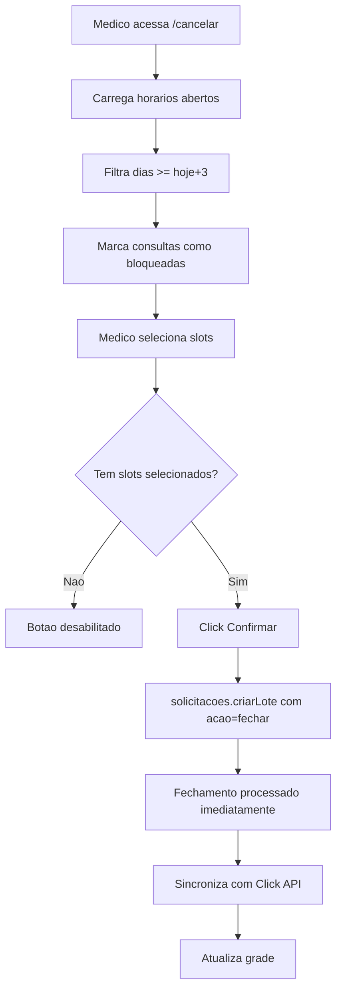

# Telas do Medico

## 1. Dashboard Semanal (`/meus-horarios`)

Tela principal do medico com visao geral de seus horarios.

### Componentes

#### CalendarioSemanal
Grade visual dos horarios aprovados da semana.

| Elemento | Cor | Significado |
|----------|-----|-------------|
| Slot verde | Verde | Horario ativo |
| Badge numerico | Azul | Quantidade de consultas |
| Slot cinza | Cinza | Horario fechado |

**Interacao**: Apenas visualizacao (nao permite alteracoes diretas).

#### MinhasSolicitacoes
Historico de solicitacoes do medico.

**Filtros disponíveis:**
- Status: pendente, aprovada, rejeitada

**Informacoes exibidas:**
- Data da solicitacao
- Dia/horario solicitado
- Status atual
- Motivo de rejeicao (se aplicavel)

**Acoes:**
- Expandir lote para ver detalhes
- Cancelar solicitacao pendente

#### ProximosAgendamentos
Lista das proximas consultas agendadas.

**Informacoes por consulta:**
- Nome do paciente
- Data e hora
- Status da anamnese (pendente/completa)
- Links externos (CRM, consulta, anamnese)

**Dados vindos da API Click:**
```typescript
{
  pacienteNome: string,
  data: string,
  hora: string,
  dataBr: string,
  diaSemana: string,
  patologias: string | null,
  statusAnamnese: "completed" | "pending" | null,
  linkCrm: string | null,
  linkConsulta: string | null,
  linkAnamnese: string | null,
  tipoConsulta: string | null
}
```

### Layout

```
┌─────────────────────────────────────────────────┐
│ Meus Horarios                                   │
├─────────────────────────────────────────────────┤
│                                                 │
│  ┌─────────────────┐  ┌─────────────────────┐  │
│  │ Score: 75       │  │ Faixa: P2           │  │
│  │ ███████████░░░  │  │                     │  │
│  └─────────────────┘  └─────────────────────┘  │
│                                                 │
│  ┌─────────────────────────────────────────┐   │
│  │         Calendario Semanal              │   │
│  │  Seg  Ter  Qua  Qui  Sex  Sab  Dom      │   │
│  │  [█]  [█]  [ ]  [█]  [█]  [ ]  [ ]      │   │
│  │  [█]  [ ]  [ ]  [█]  [█]  [ ]  [ ]      │   │
│  └─────────────────────────────────────────┘   │
│                                                 │
│  ┌──────────────┐  ┌───────────────────────┐   │
│  │ Minhas       │  │ Proximos              │   │
│  │ Solicitacoes │  │ Agendamentos          │   │
│  │              │  │                       │   │
│  │ [Lista...]   │  │ [Lista...]            │   │
│  └──────────────┘  └───────────────────────┘   │
└─────────────────────────────────────────────────┘
```

## 2. Solicitacao de Abertura (`/meus-horarios/solicitar`)

Grade interativa para solicitar abertura/fechamento de horarios.

### Grade 7x(horarios)

Estrutura: 7 colunas (dias) x N linhas (horarios de 20 min)

```
        Seg    Ter    Qua    Qui    Sex    Sab    Dom
08:00   [░]    [░]    [░]    [█]    [█]    [░]    [░]
08:20   [░]    [░]    [░]    [█]    [█]    [░]    [░]
08:40   [░]    [░]    [░]    [█]    [░]    [░]    [░]
...
```

### Estados Visuais dos Slots

| Estado | Cor | Significado |
|--------|-----|-------------|
| `empty` | Cinza claro | Slot fechado (pode abrir) |
| `selected` | Verde | Ja estava aberto (vai manter) |
| `new-selected` | Amarelo | Sera aberto (nova selecao) |
| `to-close` | Vermelho | Sera fechado |
| `locked` | Cinza + cadeado | Tem consulta (nao pode fechar) |
| `blocked` | Opacity 50% | Dia bloqueado (hoje+2) |

### Interacoes

#### Click Simples
- Slot vazio → marca para abrir (amarelo)
- Slot aberto → marca para fechar (vermelho)
- Slot marcado → desmarca

#### Shift + Click
Seleciona range do ultimo click ate o atual.

**Exemplo:**
1. Click em seg 08:00
2. Shift+click em seg 10:00
3. Todos slots entre 08:00 e 10:00 sao selecionados

### Restricoes Visuais

#### Dias Bloqueados
- Hoje e proximos 2 dias mostram icone de cadeado
- Click e ignorado nesses dias
- Tooltip: "Nao e possivel alterar horarios dos proximos 2 dias"

#### Limite de Slots
- Contador mostra: "X / Y slots" (atual / maximo da faixa)
- Se atingir limite, novos clicks sao ignorados
- Alerta: "Limite de slots atingido para sua faixa"

#### Periodos Restritos
- Slots fora do periodo da faixa ficam desabilitados
- Exemplo: P4 so pode tarde, manha/noite ficam cinza

### Sidebar de Resumo

```
┌─────────────────┐
│ Resumo          │
├─────────────────┤
│ Abrir: 5        │
│ Fechar: 2       │
│                 │
│ Total: 45/80    │
│ slots           │
├─────────────────┤
│ [Enviar]        │
│ [Cancelar]      │
└─────────────────┘
```

## 3. Cancelamento Emergencial (`/meus-horarios/cancelamento-emergencial`)

Grade especial para cancelamento de horarios com consulta.

### Diferenca da Grade Normal

- Apenas proximos 3 dias (hoje+2)
- Mostra apenas horarios abertos
- Badge mostra quantidade de consultas

### Estados Visuais

| Estado | Cor | Significado |
|--------|-----|-------------|
| `available` | Verde | Pode selecionar para cancelar |
| `selected` | Vermelho | Selecionado para cancelar |
| `locked` | Verde + badge | Tem consulta (mostra "2 consultas") |
| `pending` | Amarelo | Ja tem cancelamento pendente |

### Formulario de Motivo

```
┌─────────────────────────────────────┐
│ Motivo do Cancelamento              │
├─────────────────────────────────────┤
│ Categoria: [Selecione v]            │
│   - Doenca                          │
│   - Emergencia Familiar             │
│   - Compromisso Medico              │
│                                     │
│ Descricao (opcional):               │
│ ┌─────────────────────────────────┐ │
│ │                                 │ │
│ │                                 │ │
│ └─────────────────────────────────┘ │
│                                     │
│ [Solicitar Cancelamento]            │
└─────────────────────────────────────┘
```

### Layout Completo

```
┌─────────────────────────────────────────────────┐
│ Cancelamento Emergencial                        │
├─────────────────────────────────────────────────┤
│                                                 │
│  ⚠️ Apenas horarios dos proximos 3 dias        │
│                                                 │
│  ┌─────────────────────┐  ┌─────────────────┐  │
│  │ Grade               │  │ Formulario      │  │
│  │                     │  │                 │  │
│  │   Qui  Sex  Sab     │  │ Categoria: [v]  │  │
│  │   [█]  [░]  [░]     │  │                 │  │
│  │   [█]  [░]  [░]     │  │ Descricao:      │  │
│  │                     │  │ [____________]  │  │
│  │ [█] = com consulta  │  │                 │  │
│  │                     │  │ [Solicitar]     │  │
│  └─────────────────────┘  └─────────────────┘  │
│                                                 │
│  Solicitacoes Pendentes:                        │
│  ┌─────────────────────────────────────────┐   │
│  │ Qui 14:00 - Doenca - Aguardando...      │   │
│  └─────────────────────────────────────────┘   │
└─────────────────────────────────────────────────┘
```

## Componentes Compartilhados

### SlotCheckbox
Checkbox customizado para selecao de horarios.

```typescript
interface SlotCheckboxProps {
  diaSemana: string;
  horario: string;
  estado: "empty" | "selected" | "new-selected" | "to-close" | "locked";
  consultas?: number;
  disabled?: boolean;
  onClick: () => void;
}
```

### Card de Score/Faixa
Exibe score e faixa do medico.

```typescript
interface ScoreCardProps {
  score: number;
  faixa: "P1" | "P2" | "P3" | "P4" | "P5";
  showDetails?: boolean;
}
```

Cores por faixa:
- P1: Verde escuro
- P2: Verde
- P3: Amarelo
- P4: Laranja
- P5: Vermelho

## Rotas

| Rota | Descricao |
|------|-----------|
| `/meus-horarios` | Dashboard principal |
| `/meus-horarios/solicitar` | Grade de solicitacao |
| `/meus-horarios/cancelar` | Cancelamento regular (sem consulta) |
| `/meus-horarios/cancelamento-emergencial` | Cancelamento emergencial |

---

## 4. Cancelamento Regular (`/meus-horarios/cancelar`)

Grade para cancelamento de horarios **SEM consulta agendada**.

### Diferenca do Cancelamento Emergencial

| Aspecto | Cancelamento Regular | Cancelamento Emergencial |
|---------|---------------------|-------------------------|
| Tem consulta | NAO | SIM |
| Aprovacao | Nao precisa | Requer staff |
| Dias aplicaveis | A partir de hoje+3 | Hoje ate hoje+2 |
| Processamento | Imediato | Aguarda aprovacao |

### Restricoes

- Apenas dias a partir de **hoje + 3** (ex: se hoje e segunda, so pode cancelar quinta em diante)
- Horarios com consulta ficam bloqueados
- Slots ja fechados nao aparecem

### Layout

```
+------------------------------------------------------------------+
| Cancelar Horarios                                                 |
+------------------------------------------------------------------+
|                                                                    |
|  Selecione horarios para fechar                                    |
|  (apenas horarios sem consulta agendada)                           |
|                                                                    |
|  +---------------------------------------------------------+      |
|  | Grade de Selecao                                         |      |
|  |                                                          |      |
|  |       Qui   Sex   Sab   Dom   Seg   Ter   Qua            |      |
|  | 08:00  [█]   [█]   [░]   [░]   [█]   [█]   [░]            |      |
|  | 08:20  [█]   [░]   [░]   [░]   [█]   [█]   [░]            |      |
|  | 08:40  [░]   [░]   [░]   [░]   [█]   [░]   [░]            |      |
|  |                                                          |      |
|  | [█] = Aberto (pode selecionar)                           |      |
|  | [░] = Fechado ou bloqueado                               |      |
|  | [●] = Selecionado para fechar                            |      |
|  +---------------------------------------------------------+      |
|                                                                    |
|  Horarios selecionados: 3                                          |
|  [Confirmar Fechamento]                                            |
+------------------------------------------------------------------+
```

### Estados Visuais

| Estado | Cor | Significado |
|--------|-----|-------------|
| `aberto` | Verde | Horario ativo (pode selecionar) |
| `selecionado` | Vermelho | Marcado para fechar |
| `fechado` | Cinza | Ja esta fechado |
| `bloqueado` | Cinza + opacity | Dentro de hoje+2 dias |
| `com-consulta` | Amarelo + cadeado | Tem consulta (vai para emergencial) |

### Fluxo



### Hook useCancellationSelection

```typescript
const {
  selectedSlots,       // Set de slots selecionados
  toggleSlot,          // Toggle selecao
  selectRange,         // Selecao com Shift+Click
  clearSelection,      // Limpa selecao
  canSelect,           // Verifica se slot pode ser selecionado
  blockedDays          // Dias bloqueados (hoje+2)
} = useCancellationSelection(horarios, consultas);
```

## Hooks Utilizados

### useSlotSelection
Gerencia selecao de slots na grade.

```typescript
const {
  selectedSlots,
  toggleSlot,
  selectRange,
  clearSelection,
  getSlotState
} = useSlotSelection(horariosAtuais);
```

### useSmartPolling
Polling adaptativo para atualizacoes.

```typescript
const { interval } = useSmartPolling("meusHorarios");
// Ativo: 20s, Background: 60s
```
