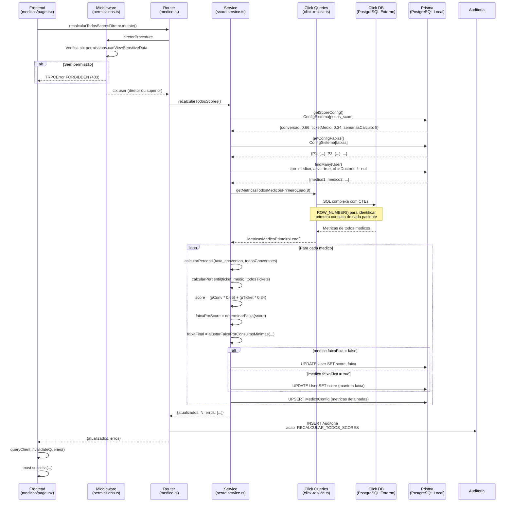
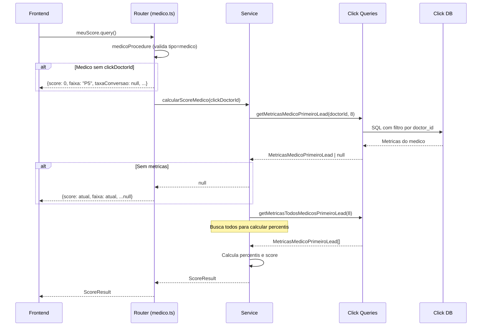
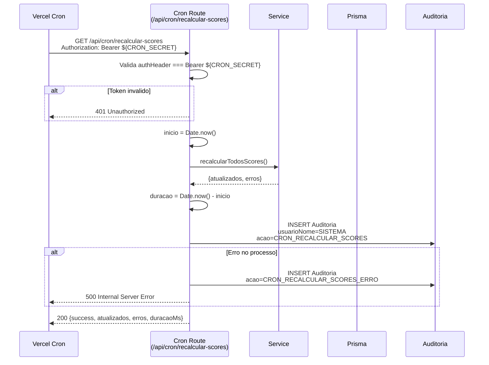
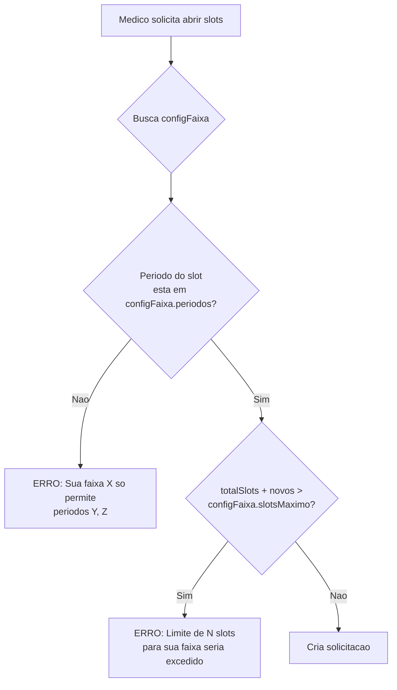

# Sistema de Calculo de Score e Faixas (P1-P5)

## Resumo Executivo

O sistema de score calcula a performance dos medicos baseado em **taxa de conversao** (66%) e **ticket medio** (34%), usando apenas dados da **primeira consulta de cada paciente** (exclui recorrencias). O score determina a faixa do medico (P1-P5), que controla limites de slots semanais e periodos permitidos para abertura de agenda. Medicos precisam atingir um **minimo de consultas realizadas** para subir de faixa, evitando que medicos sem historico suficiente recebam privilegios de faixas altas.

**Impacto direto:** A faixa do medico restringe quais horarios ele pode abrir (manha/tarde/noite) e quantos slots semanais pode ter.

---

## Indice

1. [Triggers e Endpoints](#triggers-e-endpoints)
2. [Fluxo Principal: Recalculo em Massa](#fluxo-principal-recalculo-em-massa)
3. [Fluxo Alternativo: Consulta Individual](#fluxo-alternativo-consulta-individual)
4. [Fluxo Alternativo: Cron Automatico](#fluxo-alternativo-cron-automatico)
5. [Impacto da Faixa nas Operacoes](#impacto-da-faixa-nas-operacoes)
6. [Arquivos Envolvidos](#arquivos-envolvidos)
7. [Passo a Passo Detalhado](#passo-a-passo-detalhado)
8. [Regras de Negocio](#regras-de-negocio)
9. [Formulas e Calculos](#formulas-e-calculos)
10. [Interfaces e Tipos](#interfaces-e-tipos)
11. [Configuracoes do Sistema](#configuracoes-do-sistema)
12. [Endpoints de Configuracao](#endpoints-de-configuracao)
13. [Tratamento de Erros](#tratamento-de-erros)
14. [Auditoria](#auditoria)
15. [Tabelas do Banco](#tabelas-do-banco)
16. [Dependencias](#dependencias)
17. [Observacoes Tecnicas](#observacoes-tecnicas)
18. [Glossario](#glossario)

---

## Triggers e Endpoints

### Recalculo em Massa (Manual)

| Endpoint | Permissao | Descricao |
|----------|-----------|-----------|
| `medico.recalcularTodosScoresDiretor` | diretor+ | Recalcula score de TODOS os medicos ativos |
| `medico.recalcularTodosScoresAdmin` | admin+ | Idem, para admins |

### Consulta Individual

| Endpoint | Permissao | Descricao |
|----------|-----------|-----------|
| `medico.meuScore` | medico | Retorna score atual do medico logado |
| `medico.recalcularMeuScore` | medico | Recalcula e atualiza score do medico logado |
| `medico.minhasMetricas` | medico | Retorna metricas resumidas (totalConsultas, strikes, faixa, score) |

### Cron Automatico

| Endpoint | Autenticacao | Descricao |
|----------|--------------|-----------|
| `GET /api/cron/recalcular-scores` | Bearer Token (CRON_SECRET) | Executado automaticamente via Vercel Cron |

### Configuracao (Admin)

| Endpoint | Permissao | Descricao |
|----------|-----------|-----------|
| `config.updatePesosScore` | admin | Altera pesos (conversao/ticketMedio) e periodo (semanasCalculo) |
| `config.updateFaixas` | admin | Altera limites de cada faixa (scoreMinimo, consultasMinimas, slotsMaximo, periodos) |
| `usuarios.alterarFaixaFixa` | admin | Fixa/desfixa faixa manualmente para um medico |
| `usuarios.alterarFaixa` | admin | Altera faixa diretamente (sem fixar) |

---

## Fluxo Principal: Recalculo em Massa



---

## Fluxo Alternativo: Consulta Individual

Quando o medico quer ver seu proprio score:



---

## Fluxo Alternativo: Cron Automatico



---

## Impacto da Faixa nas Operacoes

A faixa calculada pelo score **nao e apenas informativa** - ela **restringe** as operacoes do medico:

### Validacao em solicitacoes.criar

Quando um medico tenta abrir novos horarios:



**Arquivo:** `packages/api/src/routers/solicitacoes.ts:54-125`

### Restricoes por Faixa (Default)

| Faixa | Score Min | Consultas Min | Slots Max | Slots Min | Periodos Permitidos |
|-------|-----------|---------------|-----------|-----------|---------------------|
| **P1** | 80 | 100 | Ilimitado | 10 | Manha, Tarde, Noite |
| **P2** | 60 | 50 | 120 | 10 | Manha, Tarde, Noite |
| **P3** | 40 | 25 | 80 | 8 | Tarde, Noite |
| **P4** | 20 | 10 | 50 | 5 | Apenas Tarde |
| **P5** | 0 | 0 | 30 | 3 | Apenas Tarde |

### Horarios dos Periodos (Default)

| Periodo | Inicio | Fim |
|---------|--------|-----|
| Manha | 08:00 | 12:00 |
| Tarde | 12:00 | 18:00 |
| Noite | 18:00 | 21:00 |

---

## Arquivos Envolvidos

### Diagrama de Componentes

```
┌─────────────────────────────────────────────────────────────────────┐
│                           FRONTEND                                   │
├─────────────────────────────────────────────────────────────────────┤
│  apps/web/src/app/(dashboard)/dashboard/                            │
│  ├── medicos/page.tsx          → Botao "Recalcular"                 │
│  ├── config/score/page.tsx     → Config pesos do score              │
│  └── config/faixas/page.tsx    → Config limites das faixas          │
│                                                                      │
│  apps/web/src/app/api/cron/                                         │
│  └── recalcular-scores/route.ts → Endpoint do cron                  │
└─────────────────────────────────────────────────────────────────────┘
                                    │
                                    ▼
┌─────────────────────────────────────────────────────────────────────┐
│                           BACKEND (tRPC)                             │
├─────────────────────────────────────────────────────────────────────┤
│  packages/api/src/                                                   │
│  ├── routers/                                                        │
│  │   ├── medico.ts             → Endpoints de score                 │
│  │   ├── config.ts             → Endpoints de configuracao          │
│  │   ├── usuarios.ts           → alterarFaixaFixa                   │
│  │   └── solicitacoes.ts       → Usa faixa para validar             │
│  ├── services/                                                       │
│  │   └── score.service.ts      → Logica de calculo                  │
│  └── middleware/                                                     │
│      └── permissions.ts        → Guards de autorizacao              │
└─────────────────────────────────────────────────────────────────────┘
                                    │
                                    ▼
┌─────────────────────────────────────────────────────────────────────┐
│                           DATABASE                                   │
├─────────────────────────────────────────────────────────────────────┤
│  packages/db/src/                                                    │
│  └── click-replica.ts          → Queries SQL no Click               │
│                                                                      │
│  packages/db/prisma/schema/                                          │
│  ├── auth.prisma               → User (faixa, score, faixaFixa)     │
│  └── app.prisma                → MedicoConfig, ConfigSistema        │
└─────────────────────────────────────────────────────────────────────┘
```

### Tabela de Arquivos

| # | Arquivo | Responsabilidade | Linhas-chave |
|---|---------|------------------|--------------|
| 1 | `packages/api/src/services/score.service.ts` | Logica principal de calculo | 43-48, 50-55, 90-108, 110-152, 154-212 |
| 2 | `packages/db/src/click-replica.ts` | Queries SQL no banco Click | 45-63, 302-376, 378-452 |
| 3 | `packages/api/src/routers/medico.ts` | Endpoints tRPC de score | 257-288, 290-316, 318-354 |
| 4 | `packages/api/src/routers/config.ts` | Endpoints de configuracao | 91-101, 115-135 |
| 5 | `packages/api/src/routers/usuarios.ts` | Endpoint alterarFaixaFixa | 382-428 |
| 6 | `packages/api/src/routers/solicitacoes.ts` | Validacao por faixa | 54-125 |
| 7 | `packages/api/src/middleware/permissions.ts` | Guards de autorizacao | 125-134 |
| 8 | `packages/db/prisma/schema/auth.prisma` | Schema User | 19-22 |
| 9 | `packages/db/prisma/schema/app.prisma` | Schema MedicoConfig, ConfigSistema | 73-88 |
| 10 | `apps/web/src/app/api/cron/recalcular-scores/route.ts` | Cron job | 1-61 |
| 11 | `apps/web/src/app/(dashboard)/dashboard/medicos/page.tsx` | UI recalculo | 170-179, 209-217 |
| 12 | `apps/web/src/app/(dashboard)/dashboard/config/score/page.tsx` | UI config score | 1-321 |

---

## Passo a Passo Detalhado

### 1. Trigger da Mutation (Frontend)
**Arquivo:** `apps/web/src/app/(dashboard)/dashboard/medicos/page.tsx:209-217`

```tsx
<Button onClick={() => recalcularScoreMutation.mutate()}>
  <Calculator /> Recalcular
</Button>
```

A mutation esta definida em linha 170-179, usa `trpcClient.medico.recalcularTodosScoresDiretor.mutate()`.

---

### 2. Verificacao de Permissao (Middleware)
**Arquivo:** `packages/api/src/middleware/permissions.ts:125-134`

```typescript
export const diretorProcedure = authenticatedProcedure.use(({ ctx, next }) => {
  if (!ctx.permissions.canViewSensitiveData) {
    throw new TRPCError({
      code: "FORBIDDEN",
      message: "Apenas diretores ou superiores podem acessar este recurso",
    });
  }
  return next({ ctx });
});
```

`canViewSensitiveData` e true para roles: `diretor`, `admin`, `super_admin` (linha 31-33).

---

### 3. Handler do Router
**Arquivo:** `packages/api/src/routers/medico.ts:337-354`

```typescript
recalcularTodosScoresDiretor: diretorProcedure.mutation(async ({ ctx }) => {
  const result = await recalcularTodosScores();
  
  await prisma.auditoria.create({
    data: {
      usuarioId: ctx.user.id,
      usuarioNome: ctx.user.name,
      acao: "RECALCULAR_TODOS_SCORES",
      entidade: "medico",
      dadosDepois: { atualizados: result.atualizados, erros: result.erros.length },
    },
  });
  
  return result;
});
```

---

### 4. Buscar Configuracoes
**Arquivo:** `packages/api/src/services/score.service.ts:57-88`

```typescript
// Busca pesos do score
export async function getScoreConfig(): Promise<ScoreConfig> {
  const configPesos = await prisma.configSistema.findUnique({
    where: { chave: "pesos_score" },
  });
  // Retorna DEFAULT_CONFIG se nao existir
}

// Busca limites das faixas
async function getConfigFaixas(): Promise<Record<Faixa, FaixaConfig>> {
  const configFaixas = await prisma.configSistema.findUnique({
    where: { chave: "faixas" },
  });
  // Retorna DEFAULT_FAIXAS_CONFIG se nao existir
}
```

---

### 5. Buscar Medicos Ativos
**Arquivo:** `packages/api/src/services/score.service.ts:160-162`

```typescript
const medicos = await prisma.user.findMany({
  where: { tipo: "medico", ativo: true, clickDoctorId: { not: null } },
});
```

**Importante:** Medicos sem `clickDoctorId` sao ignorados (nao vinculados ao Click).

---

### 6. Query de Metricas (Click DB)
**Arquivo:** `packages/db/src/click-replica.ts:378-452`

A query usa 3 CTEs:

1. **consultas_classificadas:** Adiciona `ROW_NUMBER() OVER (PARTITION BY user_id ORDER BY start)` para identificar ordem das consultas por paciente.

2. **primeira_consulta:** Filtra apenas `rn = 1` (primeira consulta de cada paciente).

3. **metricas:** Calcula por medico:
   - `total_consultas_realizadas` (primeiro + recorrencia)
   - `consultas_primeiro_paciente`
   - `consultas_recorrencia`
   - `consultas_com_receita`
   - `orcamentos_pagos`
   - `faturamento`

---

### 7. Calculo de Percentis
**Arquivo:** `packages/api/src/services/score.service.ts:43-48`

```typescript
function calcularPercentil(valor: number, valores: number[]): number {
  if (valores.length === 0) return 0;
  const sorted = [...valores].sort((a, b) => a - b);
  const menoresOuIguais = sorted.filter(v => v <= valor).length;
  return Math.round((menoresOuIguais / sorted.length) * 100);
}
```

**Logica:** Conta quantos valores sao menores ou iguais e calcula porcentagem.

---

### 8. Calculo do Score Final
**Arquivo:** `packages/api/src/services/score.service.ts:131-133`

```typescript
const score = Math.round(
  (percentilConversao * config.conversao) + (percentilTicket * config.ticketMedio)
);
```

---

### 9. Determinar Faixa por Score
**Arquivo:** `packages/api/src/services/score.service.ts:35-41, 50-55`

```typescript
const FAIXA_LIMITES = [
  { min: 80, faixa: "P1" },
  { min: 60, faixa: "P2" },
  { min: 40, faixa: "P3" },
  { min: 20, faixa: "P4" },
  { min: 0, faixa: "P5" },
];

function determinarFaixa(score: number): Faixa {
  for (const { min, faixa } of FAIXA_LIMITES) {
    if (score >= min) return faixa;
  }
  return "P5";
}
```

---

### 10. Ajustar Faixa por Consultas Minimas
**Arquivo:** `packages/api/src/services/score.service.ts:90-108`

```typescript
function ajustarFaixaPorConsultasMinimas(
  faixaCalculada: Faixa,
  totalConsultas: number,
  configFaixas: Record<Faixa, FaixaConfig>
): Faixa {
  const ordemFaixas: Faixa[] = ["P1", "P2", "P3", "P4", "P5"];
  const idxCalculada = ordemFaixas.indexOf(faixaCalculada);
  
  // Percorre da faixa calculada ate P5
  for (let i = idxCalculada; i < ordemFaixas.length; i++) {
    const faixa = ordemFaixas[i]!;
    const minConsultas = configFaixas[faixa]?.consultasMinimas ?? 0;
    
    if (totalConsultas >= minConsultas) {
      return faixa; // Primeira faixa que atende o minimo
    }
  }
  
  return "P5";
}
```

**Exemplo:** Score 85 (P1), mas apenas 30 consultas. P1 exige 100, P2 exige 50, P3 exige 25. Como 30 >= 25, faixa final = P3.

---

### 11. Persistir no Banco Local
**Arquivo:** `packages/api/src/services/score.service.ts:176-199`

```typescript
// Se faixaFixa = true, NAO atualiza faixa
const updateData = medico.faixaFixa
  ? { score: scoreResult.score }
  : { score: scoreResult.score, faixa: scoreResult.faixa };

await prisma.$transaction([
  prisma.user.update({ where: { id: medico.id }, data: updateData }),
  prisma.medicoConfig.upsert({
    where: { medicoId: medico.id },
    update: { taxaConversao, ticketMedio, totalConsultas },
    create: { medicoId, taxaConversao, ticketMedio, totalConsultas },
  }),
]);
```

---

## Regras de Negocio

| # | Regra | Descricao | Arquivo:Linha |
|---|-------|-----------|---------------|
| 1 | Apenas primeiro lead | Taxa de conversao usa apenas a primeira consulta de cada paciente, exclui recorrencias | click-replica.ts:307-314 |
| 2 | Taxa = vendas/receitas | `taxa_conversao = orcamentos_pagos / consultas_com_receita` (NAO e vendas/consultas) | click-replica.ts:369-370 |
| 3 | Pesos configuraveis | Score = (pConv * pesoConv) + (pTicket * pesoTicket), pesos somam 1 | score.service.ts:131-133 |
| 4 | Consultas minimas | Faixa final e a melhor que o medico atende o minimo de consultas | score.service.ts:90-108 |
| 5 | Faixa fixa | Se `faixaFixa=true`, score atualiza mas faixa permanece manual | score.service.ts:176-178 |
| 6 | Periodo configuravel | Metricas calculadas sobre ultimas N semanas (default 8) | score.service.ts:32 |
| 7 | Total para minimo | `total_consultas_realizadas` (primeiro + recorrencia) valida consultasMinimas | click-replica.ts:320-325 |
| 8 | Soma dos pesos | Ao configurar pesos, `conversao + ticketMedio` deve ser exatamente 1 | config.ts:116-118 |
| 9 | Validacao de faixa | Ao solicitar slots, valida periodo e quantidade contra configFaixa | solicitacoes.ts:101-125 |
| 10 | Medico inativo ignorado | Apenas medicos com `ativo=true` e `clickDoctorId != null` sao recalculados | score.service.ts:160-162 |

---

## Formulas e Calculos

### Taxa de Conversao (por medico)
```
taxa_conversao = orcamentos_pagos / consultas_com_receita
```
- `orcamentos_pagos`: Vendas confirmadas (product_budgets.status = 'confirmed')
- `consultas_com_receita`: Primeiras consultas que geraram receita medica

### Ticket Medio (por medico)
```
ticket_medio = faturamento / orcamentos_pagos
```
- `faturamento`: SUM(value + delivery_value) das vendas confirmadas

### Percentil
```
percentil(valor, conjunto) = (count(v <= valor) / count(conjunto)) * 100
```

### Score Final
```
score = round((percentilConversao * pesoConversao) + (percentilTicket * pesoTicket))
```
Default: `pesoConversao = 0.66`, `pesoTicket = 0.34`

### Faixa por Score
```
if score >= 80 then P1
else if score >= 60 then P2
else if score >= 40 then P3
else if score >= 20 then P4
else P5
```

### Ajuste por Consultas Minimas
```
faixaFinal = primeira faixa (da calculada ate P5) onde:
  totalConsultas >= configFaixas[faixa].consultasMinimas
```

---

## Interfaces e Tipos

### ScoreResult (retorno do calculo)
```typescript
interface ScoreResult {
  score: number;                    // 0-100
  faixa: Faixa;                     // P1|P2|P3|P4|P5
  taxaConversao: number;            // 0-1 (ex: 0.45 = 45%)
  ticketMedio: number;              // Valor em reais
  percentilConversao: number;       // 0-100
  percentilTicket: number;          // 0-100
  totalConsultasRealizadas: number; // primeiro + recorrencia
}
```

### MetricasMedicoPrimeiroLead (dados do Click)
```typescript
interface MetricasMedicoPrimeiroLead {
  doctor_id: number;
  total_consultas_realizadas: number;   // primeiro + recorrencia (para validar minimo)
  consultas_primeiro_paciente: number;  // apenas primeiras consultas
  consultas_recorrencia: number;        // apenas recorrencias
  consultas_com_receita: number;        // primeiras que geraram receita
  orcamentos_pagos: number;             // vendas confirmadas
  taxa_conversao: number;               // orcamentos_pagos / consultas_com_receita
  ticket_medio: number;                 // faturamento / orcamentos_pagos
  faturamento: number;                  // valor total vendido
}
```

### FaixaConfig (limites por faixa)
```typescript
interface FaixaConfig {
  scoreMinimo: number;              // Score minimo para estar na faixa
  consultasMinimas: number;         // Consultas minimas para subir
  slotsMaximo: number | null;       // Limite de slots (null = ilimitado)
  slotsMinimo: number;              // Minimo de slots obrigatorio
  periodos: ("manha"|"tarde"|"noite")[];  // Periodos permitidos
}
```

### ScoreConfig (pesos do calculo)
```typescript
interface ScoreConfig {
  conversao: number;      // Peso da conversao (default 0.66)
  ticketMedio: number;    // Peso do ticket (default 0.34)
  semanasCalculo: number; // Periodo em semanas (default 8)
}
```

---

## Configuracoes do Sistema

Armazenadas na tabela `ConfigSistema`:

### pesos_score
```json
{
  "conversao": 0.66,
  "ticketMedio": 0.34,
  "semanasCalculo": 8
}
```

### faixas
```json
{
  "P1": { "scoreMinimo": 80, "consultasMinimas": 100, "slotsMaximo": null, "slotsMinimo": 10, "periodos": ["manha", "tarde", "noite"] },
  "P2": { "scoreMinimo": 60, "consultasMinimas": 50, "slotsMaximo": 120, "slotsMinimo": 10, "periodos": ["manha", "tarde", "noite"] },
  "P3": { "scoreMinimo": 40, "consultasMinimas": 25, "slotsMaximo": 80, "slotsMinimo": 8, "periodos": ["tarde", "noite"] },
  "P4": { "scoreMinimo": 20, "consultasMinimas": 10, "slotsMaximo": 50, "slotsMinimo": 5, "periodos": ["tarde"] },
  "P5": { "scoreMinimo": 0, "consultasMinimas": 0, "slotsMaximo": 30, "slotsMinimo": 3, "periodos": ["tarde"] }
}
```

### periodos
```json
{
  "manha": { "inicio": "08:00", "fim": "12:00" },
  "tarde": { "inicio": "12:00", "fim": "18:00" },
  "noite": { "inicio": "18:00", "fim": "21:00" }
}
```

---

## Endpoints de Configuracao

### config.updatePesosScore
**Arquivo:** `packages/api/src/routers/config.ts:115-135`

**Input:**
```typescript
z.object({
  conversao: z.number().min(0).max(1),
  ticketMedio: z.number().min(0).max(1),
  semanasCalculo: z.number().min(1).max(52).optional(),
})
```

**Validacao:** `conversao + ticketMedio !== 1` lanca erro.

**Permissao:** `adminProcedure` (admin+)

---

### config.updateFaixas
**Arquivo:** `packages/api/src/routers/config.ts:91-101`

**Input:**
```typescript
z.object({
  P1: FaixaConfigSchema,
  P2: FaixaConfigSchema,
  P3: FaixaConfigSchema,
  P4: FaixaConfigSchema,
  P5: FaixaConfigSchema,
})
```

**Permissao:** `adminProcedure` (admin+)

---

### usuarios.alterarFaixaFixa
**Arquivo:** `packages/api/src/routers/usuarios.ts:382-428`

**Input:**
```typescript
z.object({
  medicoId: z.string(),
  faixaFixa: z.boolean(),
  faixa: z.enum(["P1","P2","P3","P4","P5"]).optional(),
})
```

**Logica:**
- Se `faixaFixa=true` e `faixa` fornecida, atualiza ambos
- Registra auditoria `FAIXA_FIXA_ATIVADA` ou `FAIXA_FIXA_DESATIVADA`

**Permissao:** `adminProcedure` (admin+)

---

## Tratamento de Erros

| Cenario | Exception | Handler | Response |
|---------|-----------|---------|----------|
| Nao autenticado | TRPCError UNAUTHORIZED | permissions.ts:41-45 | 401 |
| Sem permissao | TRPCError FORBIDDEN | permissions.ts:126-130 | 403 |
| Soma pesos != 1 | Error | config.ts:116-118 | "A soma dos pesos deve ser igual a 1" |
| Medico nao encontrado | TRPCError BAD_REQUEST | usuarios.ts:395-400 | "Usuario nao e um medico" |
| Erro na query Click | Error generico | score.service.ts:203-207 | Adiciona ao array `erros`, continua loop |
| Medico sem clickDoctorId | - | score.service.ts:171 | Skip (continue) |
| Sem metricas | null | score.service.ts:119-121 | Retorna null, nao atualiza |
| Cron sem token | 401 | route.ts:10-12 | { error: "Unauthorized" } |
| Erro geral cron | 500 | route.ts:43-58 | Registra auditoria de erro |

---

## Auditoria

### Tipos de Acao Registrados

| Acao | Quando | Dados Registrados |
|------|--------|-------------------|
| `RECALCULAR_TODOS_SCORES` | Staff/Admin recalcula manual | `{ atualizados, erros.length }` |
| `CRON_RECALCULAR_SCORES` | Cron executa com sucesso | `{ atualizados, erros.length, duracaoMs }` |
| `CRON_RECALCULAR_SCORES_ERRO` | Cron falha | `{ erro: message }` |
| `FAIXA_FIXA_ATIVADA` | Admin fixa faixa | `{ dadosAntes, dadosDepois }` |
| `FAIXA_FIXA_DESATIVADA` | Admin desfixa faixa | `{ dadosAntes, dadosDepois }` |

### Campos da Auditoria

```typescript
{
  usuarioId: string | null,     // null para SISTEMA (cron)
  usuarioNome: string,          // Nome do usuario ou "SISTEMA"
  acao: string,                 // Tipo da acao
  entidade: string,             // "medico", "cron", "user"
  entidadeId?: string,          // ID do registro afetado
  dadosAntes?: object,          // Estado anterior
  dadosDepois?: object,         // Estado posterior
}
```

---

## Tabelas do Banco

### Banco Local (PostgreSQL via Prisma)

| Tabela | Campos Relevantes | Proposito |
|--------|-------------------|-----------|
| `user` | id, tipo, faixa, faixaFixa, score, ativo, clickDoctorId | Armazena medicos e seus scores |
| `medico_config` | medicoId, taxaConversao, ticketMedio, totalConsultas | Cache de metricas detalhadas |
| `config_sistema` | chave, valor, descricao | Configuracoes globais (pesos, faixas) |
| `auditoria` | usuarioId, acao, entidade, dadosAntes, dadosDepois | Log de acoes |

### Banco Click (PostgreSQL Replica - Read Only)

| Tabela | Campos Usados | Proposito |
|--------|---------------|-----------|
| `consultings` | id, user_id, doctor_id, start, completed, status, negotiation_id | Consultas realizadas |
| `medical_prescriptions` | id, consulting_id | Receitas medicas |
| `product_budgets` | id, medical_prescription_id, status, value, delivery_value | Vendas |

---

## Dependencias

### Internas
- `@clickmedicos/db` - Prisma Client para banco local
- `@clickmedicos/db/click-replica` - Pool PostgreSQL para Click
- `@clickmedicos/db/enums` - Tipos (Faixa)

### Externas
- **pg** - Driver PostgreSQL para Click Replica
- **@trpc/server** - Framework de API
- **@tanstack/react-query** - Cache e mutations no frontend
- **Vercel Cron** - Automacao de recalculo
- **sonner** - Toast notifications

---

## Observacoes Tecnicas

### Performance

**Problema:** A query `getMetricasTodosMedicosPrimeiroLead` usa `ROW_NUMBER() OVER (PARTITION BY user_id)` sobre TODA a tabela `consultings` antes de filtrar por periodo.

**Impacto:** Pode demorar 30-60 segundos em bases grandes.

**Mitigacao sugerida:**
1. Criar indice: `CREATE INDEX idx_consultings_user_start ON consultings(user_id, start)`
2. Refatorar query para filtrar por periodo ANTES do ROW_NUMBER

### Edge Cases

| Caso | Comportamento |
|------|---------------|
| Medico novo sem consultas | `total_consultas_realizadas = 0`, nao entra no resultado da query, score nao calculado |
| Medico com consultas mas sem vendas | `taxa_conversao = 0`, `ticket_medio = 0`, score baixo |
| Medico com `faixaFixa = true` | Score atualiza, faixa permanece a configurada manualmente |
| Medico sem `clickDoctorId` | Ignorado no recalculo (skip) |
| Config faixas nao existe | Usa `DEFAULT_FAIXAS_CONFIG` hardcoded |
| Config pesos nao existe | Usa `DEFAULT_CONFIG` (0.66, 0.34, 8 semanas) |

### Debitos Tecnicos

1. **Query pesada:** Filtrar por periodo antes de ROW_NUMBER
2. **Sem retry individual:** Erro em um medico nao tenta novamente
3. **Sem cache:** Metricas buscadas do Click a cada calculo
4. **Transacao por medico:** Poderia agrupar em batches para performance

---

## Glossario

| Termo | Definicao |
|-------|-----------|
| **Score** | Numero de 0-100 que representa a performance do medico |
| **Faixa** | Categoria P1-P5 baseada no score e consultas minimas |
| **Percentil** | Posicao relativa do medico comparado aos demais (0-100%) |
| **Taxa de Conversao** | Proporcao de receitas que geraram venda |
| **Ticket Medio** | Valor medio por venda realizada |
| **Primeiro Lead** | Primeira consulta de um paciente (exclui retornos) |
| **Recorrencia** | Consultas subsequentes do mesmo paciente |
| **faixaFixa** | Flag que impede alteracao automatica da faixa |
| **clickDoctorId** | ID do medico na tabela `doctors` do Click (vinculo) |
| **ConfigSistema** | Tabela que armazena configuracoes globais em JSON |

---

## Exemplo de Comportamento Completo

### Cenario

| Medico | Score | Faixa Score | Consultas | Consultas Min P1/P2/P3 | Faixa Final | Explicacao |
|--------|-------|-------------|-----------|------------------------|-------------|------------|
| Dr. Ana | 85 | P1 | 120 | 100/50/25 | **P1** | Atende score E consultas |
| Dr. Bob | 85 | P1 | 30 | 100/50/25 | **P3** | Score P1, mas 30<100, 30<50, 30>=25 |
| Dr. Carlos | 65 | P2 | 40 | 100/50/25 | **P3** | Score P2, mas 40<50, 40>=25 |
| Dr. Diana | 45 | P3 | 5 | 100/50/25 | **P5** | Score P3, mas 5<25, 5<10, 5>=0 |
| Dr. Eduardo (fixo) | 20 | P4 | 2 | - | **P2** (manual) | faixaFixa=true, mantem P2 configurado |

### Impacto na Abertura de Horarios

| Medico | Faixa | Pode abrir manha? | Pode abrir noite? | Max slots |
|--------|-------|-------------------|-------------------|-----------|
| Dr. Ana | P1 | Sim | Sim | Ilimitado |
| Dr. Bob | P3 | Nao | Sim | 80 |
| Dr. Carlos | P3 | Nao | Sim | 80 |
| Dr. Diana | P5 | Nao | Nao | 30 |
| Dr. Eduardo | P2 | Sim | Sim | 120 |

---

*Ultima atualizacao: Janeiro 2026*
